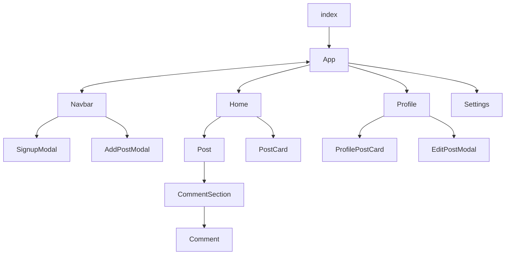

# About

Building a Forum / Reddit clone. \
Inspired by [GrammerHub Goatpad](https://github.com/grammerhub/goatpad).

## Languages, Frameworks and Tools

- ReactJS (+ React Context API)
- Firebase
  - Firebase Auth
  - Firebase Firestore
  - Firebase Storage
- TailwindCSS
- ChakraUI

# Getting Started

- Clone the repository.
- Install dependencies using `npm install`.
- Run `npm start`.
- Open the browser and navigate to [localhost:3000](http://localhost:3000/)

>`Note:` You can enter your own firebase configuration in ***FirebaseConfig.js***.

# Structure (Overview)

>`Note:` ***Navbar*** is included in ***App*** to be made available to all pages (thus the bi-directional arrow).
